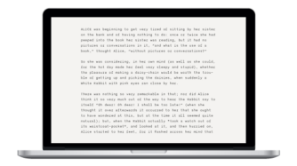

# First document


## Section 1

### Section 2

#### Section 3
##### Section 4
###### hello
1. a
2. b
3. c
4. d

* 1

Style Check is like having a personal editor-in-chief on your device, carefully reviewing your text for redundancies, clichés and filler words as you type really really fast. It's simple, different, and powerful. 

You can make great things greater and faster. You can really do the thing really well. Just in the nick of time. 

Is this a monospace font?


This Is a `code` test.

And a 

```python
def method:
  thingy
def thing. 
Code block test
```

- [ ] test
- [ ] a
- [ ] d
> this is a rthig

{{TOC}}

#test
#tags




- a
- b
- c

~~lk~~

[^hrllo?]

| a |b  |
|

{{TOC}}

--|:--|
| 1 |2  |
| 4 |3  |
